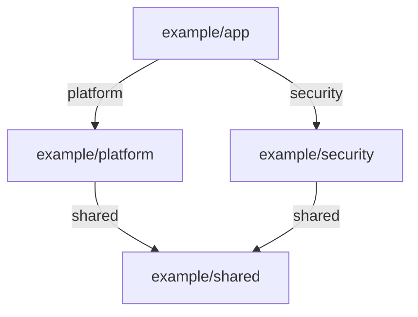

# Federation example

This repository-shaped example demonstrates AsDecided manifest version 2 with
two direct parents, a shared transitive source reached through a diamond, and
one explicit root override.



Every source is already materialised beneath `app/vendor/`. The two physical
copies of `example/shared` have identical source identity and pins, so the
verified graph deduplicates them into one logical source while retaining both
routes as evidence.

From this directory, run:

```bash
decided corpus status app/decisions
decided corpus status app/decisions --json
decided corpus explain example/shared::SHR-01K000000001 app/decisions
decided validate app/decisions
```

The qualified explain command selects the immutable shared record, then shows
that the application corpus replaces it with `APP-01K000000001` under the reviewed
`ADR-01K000000001` rationale. An unqualified `SHR-01K000000001` lookup selects the effective
replacement directly.

No command in this walkthrough fetches, refreshes, or repins a source. The
example works from any ordinary Git checkout: local-only, Cursor Origin,
GitHub, GitLab, Forgejo, or another forge does not change corpus semantics.
